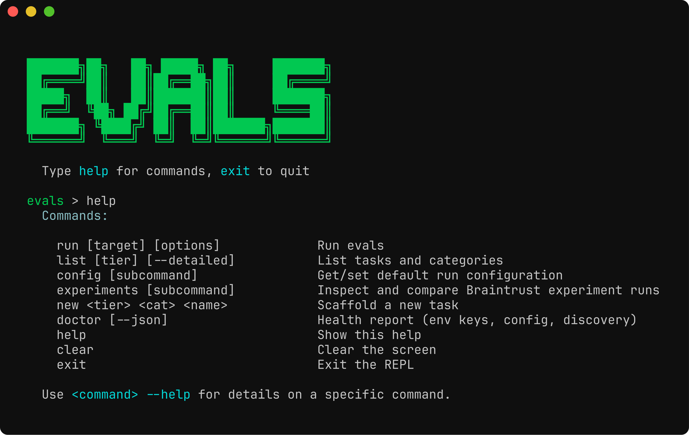
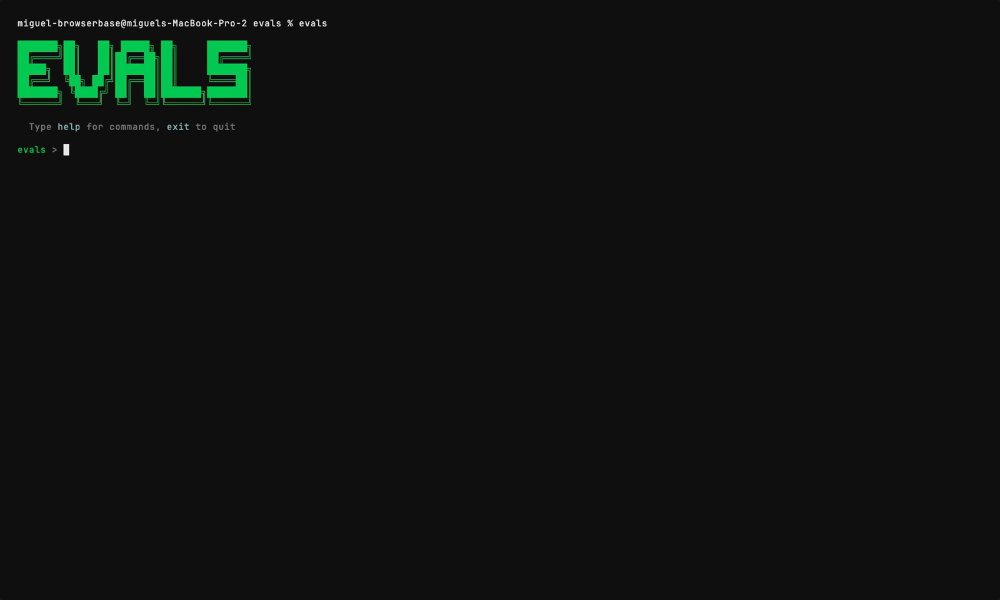

# Stagehand Evals

Agent benchmarks for Stagehand — `act`, `extract`, `observe`, `agent`, `combination`, plus dataset-backed suites (WebVoyager, OnlineMind2Web, WebTailBench, GAIA).

Driven by an interactive TUI (`evals`) or single-shot CLI (`evals run …`). Tasks are auto-discovered from `tasks/bench/<category>/` — no registration step.


## Quickstart

From the stagehand repo root:

```bash
pnpm install
pnpm build:cli   # also: pnpm build, if you haven't built the workspace yet
```

This links an `evals` binary on your `PATH`. Launch the REPL:

```bash
evals
```



Or run a single target:

```bash
evals run extract -t 3 -c 5
evals run b:webvoyager -l 10
```

A `.env` in `packages/evals/` is loaded automatically. Provide whichever provider keys (`OPENAI_API_KEY`, `ANTHROPIC_API_KEY`, `GOOGLE_GENERATIVE_AI_API_KEY`, …) and `BROWSERBASE_API_KEY` / `BROWSERBASE_PROJECT_ID` you need.

## TUI commands

Inside the REPL (or as `evals <command>` from your shell):

| Command | What it does |
| --- | --- |
| `run [target] [options]` | Run evals. Target can be a tier, category, task, or benchmark shorthand. |
| `list [tier] [--detailed]` | List discovered tasks and categories. |
| `new <tier> <category> <name>` | Scaffold a new task file. |
| `config [set\|reset\|path]` | Read or write defaults (env, trials, concurrency, model, …). |
| `experiments` | Inspect and compare Braintrust experiment runs. |
| `help` | Show command help. Append `--help` to any command for details. |

Use `Esc` to abort an in-flight run without exiting the REPL.

## Run targets

`evals run` accepts any of these shapes:

| Target | Meaning |
| --- | --- |
| _(none)_ / `all` | All bench tasks |
| `bench` | Entire bench tier |
| `act` / `extract` / `observe` / `agent` / `combination` | A category |
| `extract/extract_text` | A specific task |
| `b:webvoyager` / `b:onlineMind2Web` / `b:webtailbench` | Dataset-backed benchmark suite |

`evals list` shows everything that's been discovered:


## Common options

| Flag | Purpose |
| --- | --- |
| `-e, --env <local\|browserbase>` | Where the browser runs |
| `-t, --trials <n>` | Trials per task |
| `-c, --concurrency <n>` | Max parallel sessions |
| `-m, --model <id>` / `-p, --provider <name>` | Override the model/provider matrix |
| `--api` | Run via the Stagehand API instead of the SDK |
| `--harness <stagehand\|claude_code\|codex>` | Which agent harness drives the bench task |
| `--agent-mode <dom\|hybrid\|cua>` / `--agent-modes <csv>` | Stagehand agent mode (or matrix) |
| `-l, --limit <n>` / `-s, --sample <n>` / `-f, --filter key=value` | Suite shaping for benchmark targets |
| `--preview` | Print the resolved plan and exit — no browser, no LLM calls |

Defaults live in `evals.config.json` and can be edited via `evals config set …`.

`--preview` is useful for sanity-checking the plan before paying for a run:


A live run paints an in-place progress table, then prints a final summary with a per-model breakdown:



## Adding a bench task

```bash
evals new bench extract my_new_task
```

This drops a `defineBenchTask`-based file into `tasks/bench/extract/`. It will show up in `evals list` on next launch — no config edit needed.

```ts
// tasks/bench/extract/my_new_task.ts
import { defineBenchTask } from "../../../framework/defineTask.js";

export default defineBenchTask({
  name: "my_new_task",
  tags: ["regression"],
  run: async ({ stagehand, logger }) => {
    // ... drive stagehand, return { _success: boolean, ... }
  },
});
```

## Tracing / Observability

Runs stream into Braintrust when `BRAINTRUST_API_KEY` is set; otherwise a local summary prints to stdout. Use `evals experiments` to inspect and diff past Braintrust runs.
